# Financial Ratios and Machine Learning Integration

Financial ratios are mathematical relationships between financial variables that help interpret a company's financial results. 

Raw financial data, like a profit margin of 15%, conveys very little information on its own.

However, by standardizing these numbers into ratios, analysts can compare companies of different sizes, track performance trends over time, and benchmark against industry peers. 

## 1. Categories of Financial Ratios

Financial ratios are broadly classified into five main categories, each measuring a specific aspect of a company's business:
1. **Profitability Ratios:** Measure a company's ability to generate profits and signal the management's competitiveness.
2. **Leverage (Long-term Solvency) Ratios:** Measure the extent to which a company uses debt to finance growth and its ability to sustain operations in the long term.
3. **Liquidity (Short-term Solvency) Ratios:** Assess a firm's ability to meet its short-term debt obligations.
4. **Operating (Asset Management/Turnover) Ratios:** Measure how efficiently a business converts its assets into revenues.
5. **Valuation (Market Value) Ratios:** Compare a company's stock price to its financial performance or overall value to gauge if it is cheap or expensive.

---

## 2. Deep Dive: Types of Ratios, Terms, and Examples

### A. Profitability Ratios
These ratios evaluate how well a company generates income relative to its revenue, assets, or equity.

*   **EBITDA Margin:** Earnings Before Interest, Tax, Depreciation, and Amortization divided by Operating Revenue. It indicates operational efficiency before accounting rules and financing costs skew the numbers.
    *   *Example:* Amara Raja Batteries (ARBL) had an EBITDA of ₹560 Cr and operating revenue of ₹3436 Cr. EBITDA Margin = 560 / 3436 = 16.3%.
*   **PAT Margin (Net Profit Margin):** Profit After Tax divided by Total Revenues. It shows the final, overall profitability.
    *   *Example:* ARBL's PAT was ₹367 Cr on total revenues of ₹3482 Cr. PAT Margin = 367 / 3482 = 10.5%.
*   **Return on Equity (ROE):** Net Profit divided by Shareholders' Equity. It shows the return generated on the shareholders' capital.
    *   *The DuPont Model:* Breaks ROE into three components to reveal the *quality* of returns: **Net Profit Margin × Asset Turnover × Financial Leverage**.
    *   *Example:* ARBL's NPM (9.2%) × Asset Turnover (1.75) × Financial Leverage (1.61) = ROE of ~25.9%.
*   **Return on Assets (ROA):** Evaluates how effectively assets are used to create profits. Formula: (Net income + interest(1 - tax rate)) / Total Average Assets. 
    *   *Example:* ARBL Net Income (367.4) + Tax-shielded Interest (4.76) / Avg Assets (1955) = 19.03%.
*   **Return on Capital Employed (ROCE):** Profit before Interest & Taxes / Overall Capital Employed. Overall Capital Employed equals Short term Debt + Long term Debt + Equity.

### B. Liquidity (Short-Term Solvency) Ratios
These determine if a company has enough liquid assets to cover its short-term liabilities.

*   **Current Ratio:** Current Assets / Current Liabilities.
    *   *Example (Prufrock Corp):* $708M / $540M = 1.31 times.
*   **Quick Ratio:** (Current Assets - Inventory) / Current Liabilities. It removes inventory, which is the least liquid current asset.
    *   *Example:* ($708M - $422M) / $540M = 0.53 times.

### C. Leverage (Long-Term Solvency) Ratios
These measure debt reliance and default risk.

*   **Debt-to-Equity Ratio:** Total Debt / Total Equity.
    *   *Example:* $0.28M / $0.72M = 0.38 times.
*   **Interest Coverage (Times Interest Earned):** EBIT / Interest Expense. This measures how comfortably a company can pay its interest obligations.
    *   *Example:* EBIT of $600M / Interest of $141M = 4.26 times.

### D. Operating (Turnover) Ratios
These reflect management efficiency in utilizing resources.

*   **Inventory Turnover:** Cost of Goods Sold (COGS) / Inventory.
    *   *Example:* $1,435M / $422M = 3.40 times.
*   **Total Asset Turnover:** Sales / Total Assets.
    *   *Example:* $2,311M / $3,588M = 0.64 times.

### E. Valuation (Market Value) Ratios
These compare stock price against company fundamentals.

*   **Price to Earnings (P/E) Ratio:** Current Share Price / Earnings Per Share (EPS).
    *   *Example:* ARBL Share Price (₹661) / EPS (₹21.49) = 30.76 times.
*   **Price to Book Value (P/BV) Ratio:** Current Market Price / Book Value Per Share. The "Book Value" acts as the salvage value if the firm were liquidated. Book Value is calculated as: (Share Capital + Reserves excluding revaluation reserves) / Total Number of shares.
    *   *Example:* ARBL Price (₹661) / BV Per Share (₹79.8) = 8.3 times.
*   **Enterprise Value (EV) Multiple:** EV / EBITDA. Enterprise value equals Market Capitalization + Debt - Cash.
    *   *Example:* Prufrock EV ($3,459M) / EBITDA ($876M) = 3.95 times.

---

## 3. Real-World Use Cases & Machine Learning (ML) Integration

Raw accounting data is highly structured, making it foundational for Machine Learning in finance. Financial ratios act directly as **input variables (features)** in ML models because they reduce scale bias (allowing large and small companies to be compared) and reduce multicollinearity compared to using raw financials. 

### How ML Engineers Financial Features
Before feeding data into algorithms, ML pipelines use specific preprocessing techniques:
*   **Data Preprocessing:** Handling missing values, performing winsorization (outlier detection), and standardizing financial statements to percentages (Common-Size Statements).
*   **Static vs. Dynamic ($\Delta$) Features:** Models combine static signals (e.g., Gross Margin = 0.40, Interest Coverage = 5) non-linearly. However, time-series dynamics often dominate static levels. ML models heavily rely on rolling averages and $\Delta$ features, such as $\Delta$Revenue Growth (e.g., +11.1%), $\Delta$ROA, and $\Delta$Accruals to spot momentum and quality trends.

### ML Predictions in Real-World Scenarios

**1. Credit Risk & Loan Default Prediction:**
*   *Algorithm Example:* Random Forest.
*   *Use Case:* Banks use ML to predict if a corporate borrower will default. The model looks at leverage and coverage ratios. A combination of moderate leverage and strong interest coverage is interpreted as low default risk. However, if the ML model detects a rising Debt-to-Assets ratio alongside deteriorating cash quality (Cash Flow from Operations being lower than Net Income), it triggers an early warning signal for credit default.

**2. Equity Alpha (Stock Return) Prediction:**
*   *Algorithm Example:* XGBoost.
*   *Use Case:* Quantitative hedge funds use ML to find profitable stocks. High profit margins are interpreted by the model as a signal of strong pricing power. Conversely, if the model detects rapid earnings growth driven purely by positive accruals (a sharp reversal where $\Delta$Accruals spike but actual cash flow doesn't match), the algorithm interprets this as a "mean reversion risk" and will downweight or short the stock despite its apparent growth.

**3. Fraud and Bankruptcy Detection:**
*   *Algorithm Example:* Logistic Regression for bankruptcy prediction.
*   *Use Case:* Financial regulators and auditors use ML to detect accounting manipulation (window dressing). A common red flag in anomaly models is an unusually high "Accrual Intensity" (Accruals / Assets). When earnings are entirely driven by accrual and working capital dynamics rather than actual cash, ML models easily flag the company for potential fraud or impending bankruptcy. 

By combining these engineered ratio features with macroeconomic data and transaction-level data, ML models become robust, data-driven engines that excel across various economic cycles.